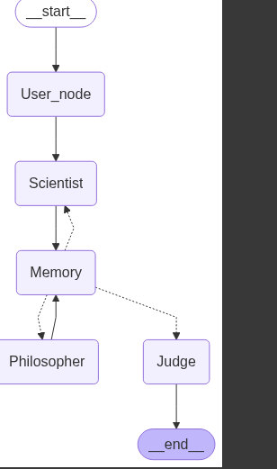

# Multi-Agent-Debate-DAG-using-LangGraph

This project implements a debate system using **LangGraph** and **Gemini Flash 1.5**, where two persona-based agents (Scientist and Philosopher) argue over a fixed topic for 8 rounds. A `Memory` node stores structured arguments and handles logical flow control, and a `Judge` node evaluates the final outcome.

---

## Logical Workflow Overview

- `User_node`: Captures debate topic.
- `Scientist` and `Philosopher`: Take alternate turns to argue.
- `Memory`: Central control node:
  - Stores and summarizes arguments
  - Tracks rounds
  - Directs control back to the correct agent
  - Ends after exactly 8 rounds (4 each)
- `Judge`: Reviews full memory, summarizes the debate, and declares a winner.

---

## 🛠️ Technologies Used

- [LangGraph](https://github.com/langchain-ai/langgraph): Agentic flow builder for stateful reasoning.
- [Gemini 1.5 Flash](https://ai.google.dev/gemini-api): Fast, efficient large language model for agent responses.
- Python 3.10+

---

## 🧩 Core Components

### `UserInputNode`
Captures the debate topic and initializes the state with:
- `topic`
- `round = 0`
- empty memory

### `Scientist` & `Philosopher`
Each agent:
- Receives only the **relevant opposing memory**
- Returns a response using Gemini Flash 2.0
- Is triggered in alternating rounds

### `Memory`
- Stores all arguments as tuples (role, argument)
- Tracks rounds
- Determines whether to continue to next agent or transition to `Judge`
- Supplies memory selectively (opponent’s arguments only)

### `Judge`
- Reviews full memory
- Generates a structured summary
- Declares a winner with justification

---

## ▶️ How to Run

1. Install dependencies:
   
pip install langgraph google-generativeai

2. Run app.py
3. Enter the debate topic when prompted. The debate will automatically proceed for 8 rounds.
